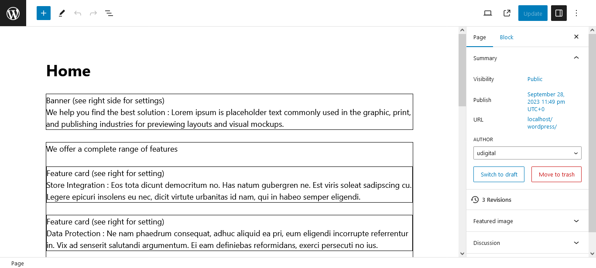

# Wordpress Block Plugin Demo

This is a Wordpress plugin that contains Gutenberg blocks.

## Tech Stack

**Wordpress, Bootstrap 5.3, SASS**

## Deployment

To deploy this project: 
1. Import wp2.sql file.
2. Copy the codes into /wordpress inside htdocs or public_html. The sql file is configured to point to http://localhost/wordpress

## Screenshots

